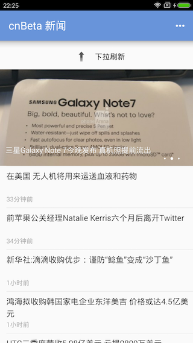
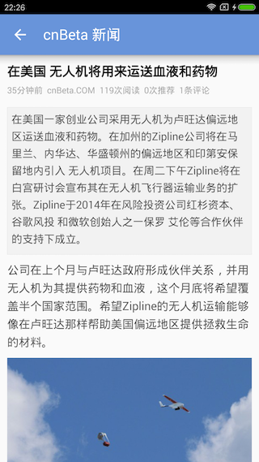
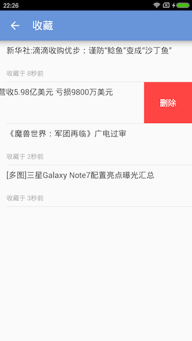

# cnBeta
cnBeta 是国内领先的即时科技资讯站点和网友交流平台。鉴于其Android客户端比较难用，界面还悬浮难看的广告，因此想做一个简洁好用的版本，以及进行一些Android技术交流。

本App界面参考了cnBeta ios客户端上的第三方客户端【西贝新闻】。

## 特点
 * 界面简洁、操作流畅。
 * 支持文章收藏。
 * 支持离线阅读。
 * 支持字体大小设置。
 * 内容内容自动缓存，节省流量。
 * 下拉刷新，滑动到底部加载更多。

## 界面





## License

```
The MIT License (MIT)

Copyright (c) 2016 TerryTao

Permission is hereby granted, free of charge, to any person obtaining a copy
of this software and associated documentation files (the "Software"), to deal
in the Software without restriction, including without limitation the rights
to use, copy, modify, merge, publish, distribute, sublicense, and/or sell
copies of the Software, and to permit persons to whom the Software is
furnished to do so, subject to the following conditions:

The above copyright notice and this permission notice shall be included in all
copies or substantial portions of the Software.

THE SOFTWARE IS PROVIDED "AS IS", WITHOUT WARRANTY OF ANY KIND, EXPRESS OR
IMPLIED, INCLUDING BUT NOT LIMITED TO THE WARRANTIES OF MERCHANTABILITY,
FITNESS FOR A PARTICULAR PURPOSE AND NONINFRINGEMENT. IN NO EVENT SHALL THE
AUTHORS OR COPYRIGHT HOLDERS BE LIABLE FOR ANY CLAIM, DAMAGES OR OTHER
LIABILITY, WHETHER IN AN ACTION OF CONTRACT, TORT OR OTHERWISE, ARISING FROM,
OUT OF OR IN CONNECTION WITH THE SOFTWARE OR THE USE OR OTHER DEALINGS IN THE
SOFTWARE.
```
